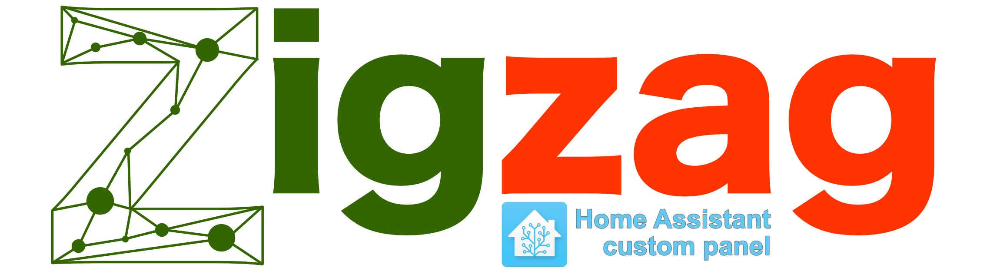

<!-- ⚠️ This README has been generated from the file(s) "blueprint.md" ⚠️-->


<h1 align="center">@samantha-uk/zigzag-panel</h1>

   [](https://discord.gg/XZ49RcWQM2)


[](#table-of-contents)

## Table of Contents

* [Description](#description)
* [Installation](#installation)
	* [Prerequisites](#prerequisites)
	* [Installation Steps](#installation-steps)
* [Plugins](#plugins)
	* [data](#data)
	* [layout](#layout)
	* [render](#render)
* [Configuration](#configuration)
* [Usage](#usage)
* [Key to display icons & legends](#key-to-display-icons--legends)
* [If Zigzag is not working correctly](#if-zigzag-is-not-working-correctly)
* [Know Issues](#know-issues)
* [Contributing](#contributing)
	* [License](#license)


[](#description)

# Description
Zigzag-panel is a custom panel for [Home Assistant](https://www.home-assistant.io/) that displays a graphical layout of Zigbee devices and the connections between them.

In Zigzag, Zigbee devices are known as Zigs and the connections between them as Zags.

Zigzag-panel is built using the [Zigzag web component](/zigzag).

_Zigzag is currently an alpha release. There are likely to be a number of issues and new releases may be frequent._


[](#installation)

# Installation
At present the installation of Zigzag is a manual process.


[](#prerequisites)

## Prerequisites

- [Home Assistant](https://www.home-assistant.io/) - version `2020.12.0` or more recent. 
- [ZHA](https://www.home-assistant.io/integrations/zha/) - A Home Assistant Zigbee Integration.
 _The plugin architecture of Zigzag means new sources of Zigbee information can be easily added.  Support for zigbee2mqtt is under investigation._
- A browser/os/driver combination that supports WebGL.  Zigzag requires WebGL to work.

[](#installation-steps)

## Installation Steps

You will need to:

- Copy the [zigzag](zigzag/) directory (_and its contents_) to a `zigzag` directory in the `www` folder of your Home Assistant server.
It should then look something like this (_There may be a number of .map files also._):
```
└── www
    └── zigzag
        ├── plugins
        │   ├── plugin-data-file.esm.js
        │   ├── plugin-data-gen.esm.js
        │   ├── plugin-data-zha.esm.js
        │   ├── plugin-layout-d3.esm.js
        │   └── plugin-render-pixi.esm.js
        ├── zigzag-panel-config.yaml
        └── zigzag-panel.esm.js
```
- Copy the contents of `zigzag/zigzag-panel-config.yaml` into your Home Assistant `configuration.yaml` file.
- Restart Home Assistant.
- Zigzag should appear as an entry on the left of the display, selecting this will display your Zigbee network.
_If not, check in the console of your web browser for any error messages._ Check [If Zigzag is not working correctly](#if-zigzag-is-not-working-correctly) for details of how.


[](#plugins)

# Plugins
Plugins allow Zigzag behaviour to be configured.  A plugin based approach was selected to facilitate:
- **Performance** - Only the code for the behaviour you want needs to be downloaded to your browser when it is required (_lazy-loading_).
- **Extensibility** - To add (_for instance_) a new source of Zigbee data (_zigbee2mqtt for example_).

Plugins may be authored as part of the Zigzag project or by third parties.


[](#data)

## data
The `data` plugin is used to specify where Zigzag will read the details of Zigs and Zags.


| Plugin Type | Description                                                                                              | More Info                                 |
| ----------- | -------------------------------------------------------------------------------------------------------- | ----------------------------------------- |
| file        | Gets Zigzag information from a json file                                                                 | [file](/zigzag/modules/data/plugins/file) |
| gen         | Gets Zigzag information from a json file and then generates more entires (_Used for performance tuning_) | [gen](/zigzag/modules/data/plugins/gen)   |
| zha         | Gets Zigzag information from the Home Asssistant ZHA integration                                         | [zha](/zigzag/modules/data/plugins/zha)   |


[](#layout)

## layout
The `layout` plugin contains the logic Zigzag uses to arrange the layout of Zigs.
| Plugin Type | Description                                                         | More Info                               |
| ----------- | ------------------------------------------------------------------- | --------------------------------------- |
| d3          | Uses [D3](https://d3js.org/) forces module to layout the Zigs. file | [d3](/zigzag/modules/layout/plugins/d3) |


[](#render)

## render
The `render` plugin is what displays the Zigzag network on the screen.

| Plugin Type | Description                                                       | More Info                                     |
| ----------- | ----------------------------------------------------------------- | --------------------------------------------- |
| pixi        | Uses [PixiJS](https://www.pixijs.com/) to display a 2d view. file | [pixi](/zigzag/modules/render/plugins/pixijs) |
| three       | Uses [three.js](https://threejs.org)  to display a 3d view.       | [three](/zigzag/modules/render/plugins/three) |


[](#configuration)

# Configuration
Configuration of Zigzag panel allows you to specify which `plugins` it will use.  Configuration is carried out by editing entries in the Home Assistant `configuration.yaml` file.

So if you wanted to use `file` based data, with `d3` layout and being rendered using `three` you would edit the `zigzag-panel` section configuration.yaml as follows.

```yaml
panel_custom:
  - name: custom-panel-zigzag
    sidebar_title: Zigzag
    sidebar_icon: mdi:zigbee
    url_path: zigzag
    module_url: /local/zigzag/zigzag-panel.esm.js
    trust_external_script: true
    config:
      who: world

      zigzag:
        plugin-path: "/local/zigzag/plugins"
        plugin-data:
          type: "file"
          filepath: "/local/zigzag/devices.json"

        plugin-layout:
          type: "d3"

        plugin-render:
          type: "three"
```

Plugin specific configuration items are documented in their respective readme files (_Links to these are in the tables above_).


[](#usage)

# Usage
You can zoom in/out and pan around to examine the graph.
You can change the location of a Zag by dragging it.  Once this is done it will remain `locked` in that position (_Displaying a small lock icon_). To unlock a Zig, click/press for about half a second and when you release it will unlock.


[](#key-to-display-icons--legends)

# Key to display icons & legends
TBD


[](#if-zigzag-is-not-working-correctly)

# If Zigzag is not working correctly
- Check in the browser console and see if any errors are being reported. [Finding Your Browser's Developer Console](https://balsamiq.com/support/faqs/browserconsole/#:~:text=To%20open%20the%20developer%20console,(on%20Windows%2FLinux).)
- Raise an [issue](https://github.com/Samantha-uk/one/issues) and include your browser console output.
- Ask a question in [](https://discord.gg/XZ49RcWQM2)


[](#know-issues)

# Know Issues
- It doesn't correctly Zoom to Fit on initial display.  Clicking the `ZOOM TO FIT` button will work.

[](#contributing)

# Contributing
Contributions, issues and feature requests are welcome.
Feel free to check the issues page if you would like to contribute.
[Check the contributing guide](/CONTRIBUTING.md).


[](#license)

## License
	
Licensed under [MIT](https://opensource.org/licenses/MIT).
